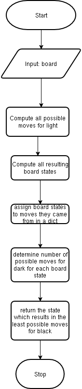

<h1>ECM 1400 Coursework 2: Othello</h1>
    <h2>How to run</h2>
        <p>
        Navigate to Stage_3 directory, enable a virtual environment(If not exists create a virtual environment, detailed in manual.doc),
        </p>
        <p>run</p>
            ```
            python flask_game_engine.py
            ```
        <p>This will start a flask server, in your terminal emulator there will be a url to where it is locally hosted, navigate to the webpage at that url to use the program</p>
    <h2>Explanation of algorithms used</h2>
    
    <h2>Explanation of modules</h2>
        <h3>components.py</h3>
            <p>
            The components.py module contains 6 functions: 
            initialise_board, print_board, check_match in direction, check_adjacent, check_outflanks, legal_move.
            The last 4 of those are interlinked so this can be decomposed into 3 elements of functionality:
            </p>
            <ul>
                <li>Initialising a base board - this gives a means of accessing a base board for a game to start on</li>
                <li>Printing a board - this gives a means of outputting a board object in a readable fashion</li>
                <li>Checking legal moves - this gives a means of determining the legality of any given move.</li>
                <li>Overall as a result this module provides these three distinct functionalities which are fundamental to the function of the other included modules</li>
            </ul>
        <h3>flask_game_engine.py</h3>
            <p>
            The flask_game_engine.py module is the central module responsible for the main functionality of the game itself,
            it can be decomposed similarly to the components module, it contains:
            </p>
            <ul>
                <li>Functions for additional functionality which are not included in the components module - swap_player, change_outflanked_stones, any_legal_moves, check_score</li>
                <li>A root route for rendering the template on page load</li>
                <li>A save route for saving the game(bound to an html button in the template)</li>
                <li>A load route for loading a saved game(bound to an html button in the template)</li>
                <li>A bot route for retrieving and playing the bot's move</li>
                <li>A move route for handling the player route(bound to the player pressing an element on the board)</li>
            </ul>
            <p>
            The functions defined for additional functionality are used in the bot and move routes,
            all routes reference a globally defined dictionary called data which is used as a response body in bot and move routes.
            </p>
        <h3>othello_bot.py</h3>
            <p>
            The othello_bot.py module defines the behaviour for the othello bot, it can be decomposed into 2 elements of functionality:
            </p>
            <ul>
                <li>Functions for additional functionality not included in the components module - swap_player, all_legal_moves, change_outflanked_stones
                <li>Predicting the move for the bot to play</li>
            </ul>
            <p>
            The important part is how the bot predicts moves, to do this is calculate's all possible moves for the player it is playing, 
            then it calculates all resulting board positions 
            and finally it determines the position which results in the least possible number of moves for the opposing player
            and decides on the move which lead to that position.
            </p>
        <h3>index.html</h3>
            <p>
            This isn't necessarily a module as such but for the sake of completeness I will summarise my changes here:
            </p>
            <ul>
                <li>Added html elements for a save button, load button and file input</li>
                <li>Added functions bound to both save and load buttons which execute the functions at the routes in flask_game_engine.py and apply some basic functionality in the index.html file<li>
                <li>Added a bot function which is called from within the sendMove function and executes the functions at the bot route in flask_game_engine.py and applies some basic functionality in index.html</li>
            </ul>
    <h2>Reasoning behind choices made</h2>
        <p>This section will go through each module and detail key design choices made and their rationale</p>
        <h3>components.py</h3>
            <p>
            Firstly, within the initialise_board function
            I decided to generalise the size of the board when filling it with its default values,
            this was achieved using integer division to determine the middle 4 points(where applicable) for a general size,
            I chose to do this for testing purposes as being able to restrict the boards size can help with testing game end conditions, cases at the edge of the board etc..
            </p>
            <p>
            Lastly, when determining the legality of a move I split this into a series of helper functions which link together in a chain like fashion,
            This was primarily done for the sake of modularity as I felt each function was distinct enough from the others to warrant a seperate helper function for clarity,
            also due to the recursive nature of the check_match_in_direction function some level of seperation was necessary.
            Additionally I decided on a recursive method for checking whether a move outflanks any other, I check whether it outflanks recursively in all possible directions,
            my reasoning for this is that the number of iterations is variable and a recursive method can ascertain the correct number of recursions independently making it an apt solution.
            </p>
        <h3>flask_game_engine.py</h3>
            <p>
            Firstly, within the change_outflanked_stones function I used a recursive method for reasons similar to the above
            </p>
            <p>
            Secondly, I made the decision to use a globally defined dictionary called data,
            this interfaced with essentially all functions within this module and acted as a response body for the bot and move routes.
            I decided to do it this way to connect all my functions together in a sense so that there are no issues with changing a variable in one function and not another,
            also this allowed me to easily interface with the flask template as the data structure used for all functions also acted as a response body.
            Additionally I was able to easily pass elements to the frontend by simply adding additional entries to my data dictionary.
            </p>
            <p>
            Thirdly, I decided to implement seperate routes for load, save, bot and move, this aided modularity and clarity in my solution and allowed me to bind seperate functionality to different processes,
            for example binding the save/load buttons to html button click events or binding move to the event of players clicking a cell
            </p>
            <p>
            Finally, for save functionallity I decided to use the os standard library to create a specific directory local to the project for saves to be stored,
            this allowed me to when loading data look in a specific directory for my save files simplifying the loading process and cleaning up file structure in the project files,
            (by not having save files mixed with program files). Additionally I used an html file element to allow the user to select the save file making for easy selection of saves.
            </p>
        <h3>othello_opponent.py</h3>
            <p>
            When designing my bot I thought about a number of strategies which may be effective in the game of othello eg:
            maximising stones captured, prioritising certain kinds of captures(ie: diagonals, horizontals or verticals), etc..., 
            but in the end I decided to minimise the number of potential moves my opponent has on the following turn.
            My thinking was that by minimising their possible moves it is more likely to eliminate all moves for the opponent on any given turn
            giving the bot multiple consecutive turns.
            </p>


